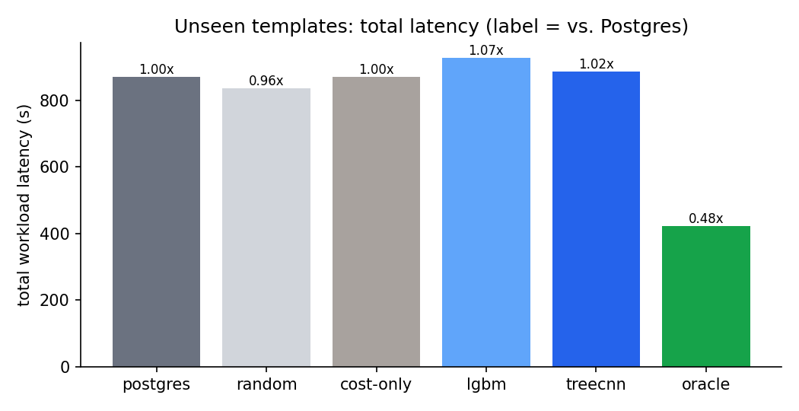
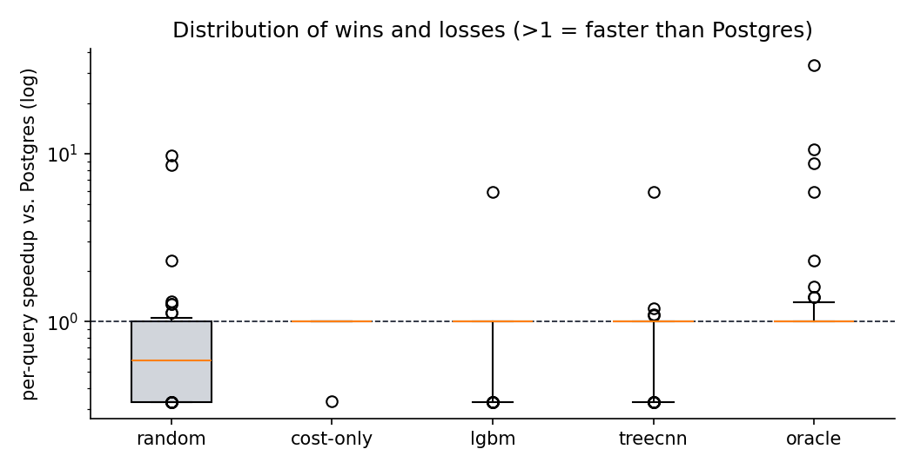
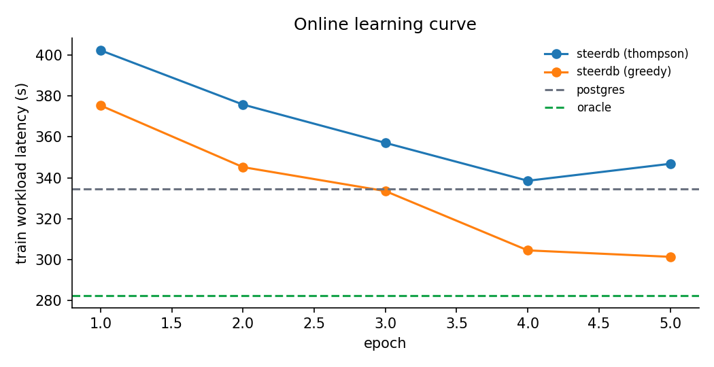
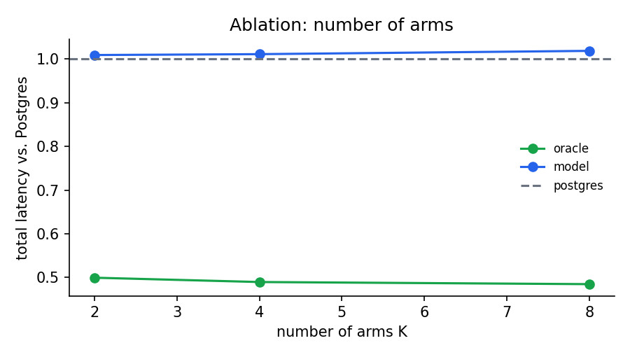

# steerdb results

_Generated 2026-09-23 13:54:02 by `python experiments/run_eval.py`. Do not edit by hand._

## Setup

- Machine: Windows-11-10.0.26200-SP0 (Intel64 Family 6 Model 170 Stepping 4, GenuineIntel), Python 3.12.6
- Session settings: `geqo_seed=0`, `max_parallel_workers_per_gather=0`, `jit=off`
- Workload: 153 queries (CEB 40, JOB 113)
- Protocol: 5-fold leave-templates-out cross-validation. Every query is predicted by models trained only on other templates (~122 training queries per fold).
- Labels: warm cache, 1 warm-up + median of 3 runs; timeouts recorded as the timeout (censored)

## Go/no-go: oracle gap

Best-arm oracle vs. stock Postgres (total workload time):

| Workload | Queries | Postgres | Oracle | Improvement | Best-arm counts |
|---|---|---|---|---|---|
| all | 153 | 869.22 s | 421.49 s | **51.5%** | {0: 137, 1: 3, 2: 3, 3: 3, 4: 2, 6: 3, 7: 2} |
| CEB | 40 | 623.42 s | 196.61 s | **68.5%** | {0: 32, 1: 1, 2: 3, 3: 3, 4: 1} |
| JOB | 113 | 245.80 s | 224.88 s | **8.5%** | {0: 105, 1: 2, 4: 1, 6: 3, 7: 2} |

## Headline: unseen templates (cross-validated)

| Policy | Total | vs. Postgres | p50 | p95 | p99 | Mean regret | >20% slower | >20% faster |
|---|---|---|---|---|---|---|---|---|
| postgres | 869.22 s | 1.000x | 812.8 ms | 14.87 s | 92.87 s | 38.5% | 0 | 0 |
| oracle | 421.49 s | 0.485x | 774.0 ms | 11.82 s | 14.88 s | 0.0% | 0 | 10 |
| random | 835.96 s | 0.962x | 1.63 s | 13.22 s | 38.74 s | 122.3% | 77 | 6 |
| cost-only | 869.44 s | 1.000x | 812.8 ms | 14.87 s | 92.87 s | 39.8% | 1 | 0 |
| lgbm | 926.58 s | 1.066x | 903.7 ms | 18.34 s | 92.87 s | 48.8% | 11 | 1 |
| treecnn | 885.13 s | 1.018x | 909.1 ms | 14.21 s | 92.87 s | 51.9% | 13 | 1 |

Effective latency includes the safety timeout: a non-default plan slower than 2x the Postgres latency is cancelled and arm 0 rerun (cost = timeout + arm 0).

### CEB only

| Policy | Total | vs. Postgres | p50 | p95 | p99 | Mean regret | >20% slower | >20% faster |
|---|---|---|---|---|---|---|---|---|
| postgres | 623.42 s | 1.000x | 2.89 s | 88.48 s | 177.92 s | 130.1% | 0 | 0 |
| oracle | 196.61 s | 0.315x | 2.89 s | 12.06 s | 32.86 s | 0.0% | 0 | 6 |
| random | 503.85 s | 0.808x | 4.47 s | 31.36 s | 158.22 s | 159.1% | 17 | 5 |
| cost-only | 623.42 s | 1.000x | 2.89 s | 88.48 s | 177.92 s | 130.1% | 0 | 0 |
| lgbm | 670.34 s | 1.075x | 3.05 s | 88.48 s | 177.92 s | 152.2% | 5 | 0 |
| treecnn | 628.87 s | 1.009x | 3.12 s | 88.48 s | 177.92 s | 144.2% | 3 | 0 |

### JOB only

| Policy | Total | vs. Postgres | p50 | p95 | p99 | Mean regret | >20% slower | >20% faster |
|---|---|---|---|---|---|---|---|---|
| postgres | 245.80 s | 1.000x | 451.7 ms | 11.22 s | 15.67 s | 6.0% | 0 | 0 |
| oracle | 224.88 s | 0.915x | 451.7 ms | 10.22 s | 13.41 s | 0.0% | 0 | 4 |
| random | 332.11 s | 1.351x | 1.08 s | 12.62 s | 15.69 s | 109.2% | 60 | 1 |
| cost-only | 246.02 s | 1.001x | 451.7 ms | 11.22 s | 15.67 s | 7.8% | 1 | 0 |
| lgbm | 256.24 s | 1.042x | 451.7 ms | 11.22 s | 15.67 s | 12.3% | 6 | 1 |
| treecnn | 256.26 s | 1.043x | 543.1 ms | 11.22 s | 15.54 s | 19.3% | 10 | 1 |

## Regressions (>20% slower than Postgres)

**treecnn:** 13 regression(s)

| Query | Chosen arm | Chosen | Postgres | Oracle arm | Oracle | Slowdown |
|---|---|---|---|---|---|---|
| 15a | 7 | 2.14 s | 713.3 ms | 0 | 713.3 ms | 3.00x |
| 15b | 1 | 126.2 ms | 42.2 ms | 0 | 42.2 ms | 2.99x |
| 15c | 1 | 1.99 s | 664.3 ms | 0 | 664.3 ms | 3.00x |
| 15d | 1 | 2.48 s | 826.5 ms | 0 | 826.5 ms | 3.00x |
| 24b | 3 | 385.9 ms | 128.9 ms | 0 | 128.9 ms | 2.99x |
| 26b | 3 | 774.3 ms | 258.3 ms | 0 | 258.3 ms | 3.00x |
| 26c | 2 | 2.44 s | 812.8 ms | 0 | 812.8 ms | 3.00x |
| 28a | 3 | 2.31 s | 769.3 ms | 0 | 769.3 ms | 3.00x |
| 30a | 5 | 7.63 s | 2.54 s | 0 | 2.54 s | 3.00x |
| 33c | 3 | 583.5 ms | 194.5 ms | 0 | 194.5 ms | 3.00x |
| ceb8a_05 | 3 | 5.84 s | 1.95 s | 0 | 1.95 s | 3.00x |
| ceb9a_03 | 4 | 5.40 s | 1.80 s | 0 | 1.80 s | 3.00x |
| ceb9a_04 | 7 | 1.13 s | 376.6 ms | 0 | 376.6 ms | 3.00x |

**lgbm:** 11 regression(s)

| Query | Chosen arm | Chosen | Postgres | Oracle arm | Oracle | Slowdown |
|---|---|---|---|---|---|---|
| 15c | 7 | 1.99 s | 664.3 ms | 0 | 664.3 ms | 3.00x |
| 15d | 4 | 2.48 s | 826.5 ms | 0 | 826.5 ms | 3.00x |
| 26a | 2 | 3.08 s | 1.03 s | 0 | 1.03 s | 3.00x |
| 28a | 1 | 2.31 s | 769.3 ms | 0 | 769.3 ms | 3.00x |
| 28c | 4 | 1.67 s | 558.3 ms | 0 | 558.3 ms | 3.00x |
| 30a | 3 | 7.63 s | 2.54 s | 0 | 2.54 s | 3.00x |
| ceb11a_04 | 1 | 30.14 s | 16.36 s | 0 | 16.36 s | 1.84x |
| ceb7a_01 | 3 | 8.33 s | 2.78 s | 0 | 2.78 s | 3.00x |
| ceb7a_02 | 3 | 16.09 s | 5.36 s | 0 | 5.36 s | 3.00x |
| ceb7a_03 | 3 | 22.58 s | 7.53 s | 0 | 7.53 s | 3.00x |
| ceb7a_05 | 3 | 2.72 s | 908.1 ms | 0 | 908.1 ms | 3.00x |

## Online learning (replay of bootstrap latencies)

| Mode | Epoch | Train workload | Explored | Fallbacks | Test vs. Postgres |
|---|---|---|---|---|---|
| thompson | 1 | 402.28 s | 28 | 34 | 1.000x |
| thompson | 2 | 375.78 s | 25 | 25 | 1.011x |
| thompson | 3 | 357.08 s | 20 | 15 | 1.007x |
| thompson | 4 | 338.58 s | 13 | 12 | 1.000x |
| thompson | 5 | 346.86 s | 15 | 12 | 1.016x |
| greedy | 1 | 375.34 s | 0 | 13 | 1.007x |
| greedy | 2 | 345.24 s | 0 | 8 | 1.007x |
| greedy | 3 | 333.54 s | 0 | 3 | 1.000x |
| greedy | 4 | 304.58 s | 0 | 1 | 1.000x |
| greedy | 5 | 301.43 s | 0 | 5 | 1.007x |

Reference train workload: Postgres 334.57 s, oracle 282.62 s.

## Ablations

### Number of arms K

| K | Arms | Postgres | Oracle | Model | Model vs. Postgres | Regressions |
|---|---|---|---|---|---|---|
| 2 | [0, 1] | 869.22 s | 434.29 s | 876.86 s | 1.009x | 2 |
| 4 | [0, 1, 3, 6] | 869.22 s | 425.71 s | 878.59 s | 1.011x | 7 |
| 8 | [0, 1, 2, 3, 4, 5, 6, 7] | 869.22 s | 421.49 s | 885.13 s | 1.018x | 13 |

### Amount of training data (fraction of train templates)

| Fraction | Train queries | Model vs. Postgres | Mean regret | Regressions |
|---|---|---|---|---|
| 25% | 32 | 1.055x | 56.0% | 16 |
| 50% | 64 | 1.014x | 44.3% | 7 |
| 100% | 122 | 1.018x | 51.9% | 13 |

### Seen vs. unseen templates

A random split puts near-duplicate variants (e.g. `16a`/`16b`) on both sides, which inflates results. Compare:

| Split | Model vs. Postgres | Oracle vs. Postgres | Mean regret |
|---|---|---|---|
| random (leaky) | 1.070x | 0.927x | 15.2% |
| template (honest) | 1.018x | 0.485x | 51.9% |
